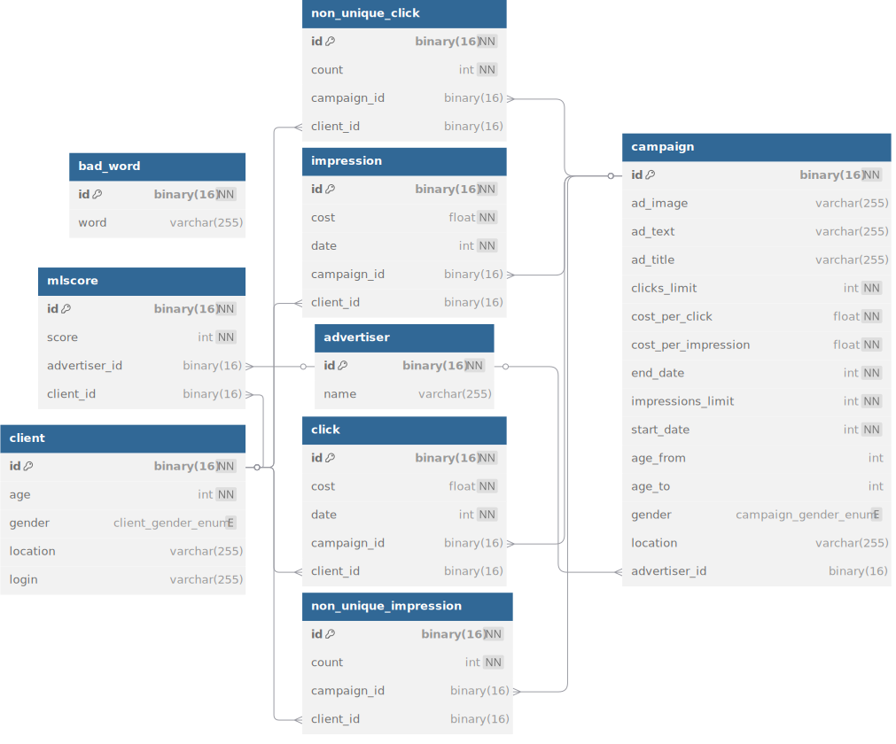

# project

## Описание проекта

Этот проект представляет собой рекламную платформу, которая позволяет рекламодателям управлять своими рекламными кампаниями. Платформа включает:
- Управление кампаниями (создание, редактирование, удаление).
- Подбор релевантной рекламы для пользователей.

## Инструкция по запуску

### Требования

- Docker
- Docker Compose

### Запуск приложения

1. Клонируйте репозиторий:

    ```sh
    git clone https://gitlab.prodcontest.ru/2025-final-projects-back/ya-ilya.git
    cd project
    ```

2. Запустите Docker Compose:

    ```sh
    docker-compose up --build
    ```

3. После успешного запуска:

- Приложение будет доступно по адресу: http://localhost:8080.
- Grafana будет доступна по адресу: http://localhost:3000.

## Структура `docker-compose.yml`

### Сервисы

1. `database:`
   - Контейнер: MySQL.
   - Порт: 3306 (проброшен на 33061 на хосте).
   - Назначение: Хранение данных о кампаниях, пользователях и статистике.

2. `grafana:`
   - Контейнер: Grafana.
   - Порт: 3000.
   - Назначение: Визуализация данных (например, статистика по кампаниям).

3. `backend:`
   - Контейнер: Spring Boot приложение.
   - Порт: 8080.
   - Назначение: Основная логика платформы (API, обработка данных).
   - Зависимости: Зависит от сервиса database (ожидает, пока база данных будет готова).

### Тома

- `mysql_data`: Том для хранения данных базы данных MySQL.
- `grafana_data`: Том для хранения данных Grafana.
- `backend_data`: Том для хранения изображений.

### Сети

- `net`: Общая сеть для взаимодействия сервисов.

## Схема данных СУБД

<picture>
  <source media="(prefers-color-scheme: dark)" srcset="assets/database_dark.svg">
  
</picture>

## Описание работы метода показа рекламы

Процесс подбора релевантной рекламы состоит из двух этапов: **фильтрация** и **сортировка**.

### Фильтрация
На этом этапе отсеиваются кампании, которые не подходят по параметрам пользователя или неактивны. Учитываются следующие критерии:

- Пол: Должен совпадать с пользователем или быть ALL.
- Возраст: Должен находиться в диапазоне, указанном в кампании.
- Локация: (опционально) Должна полностью совпадать с локацией пользователя (регистр учитывается).
- Лимиты: Количество показов и кликов не должно превышать установленных лимитов.
- Дата: Текущая дата должна находиться в пределах startDate и endDate.

### Сортировка
После фильтрации оставшиеся кампании сортируются по релевантности. Учитываются следующие показатели:

- ML-скор (по убыванию, вес = 3): Используется для определения релевантности кампании пользователю на основе машинного обучения.
- Количество неуникальных показов (по возрастанию, вес = 1): Меньшее количество показов данному пользователю увеличивает приоритет кампании.
- Количество неуникальных кликов (по убыванию, вес = 2): Большее количество кликов от данного пользователя увеличивает приоритет кампании.
- Конверсия (по убыванию, вес = 3): Высокая конверсия (отношение кликов к показам) повышает приоритет кампании.
- Оставшиеся показы (по убыванию, вес = 1): Кампании с большим количеством оставшихся показов имеют более высокий приоритет.
- Оставшиеся клики (по убыванию, вес = 2): Кампании с большим количеством оставшихся кликов имеют более высокий приоритет.
- Цена за показ (по убыванию, вес = 1): Кампании с более высокой ценой за показ имеют более высокий приоритет.
- Цена за клик (по убыванию, вес = 1): Кампании с более высокой ценой за клик имеют более высокий приоритет.

## Обоснованность решения

1. Kotlin
   - Причина: Kotlin — это современный, безопасный и лаконичный язык, который полностью совместим с Java.
   - Преимущества:
     - Меньше шаблонного кода по сравнению с Java.
     - Null Safety снижает вероятность ошибок.

2. Spring Boot
   - Причина: Spring Boot — это мощный фреймворк для разработки микросервисов и монолитных приложений. Он предоставляет встроенные решения для работы с базами данных, веб-запросами, валидацией и многим другим, что значительно ускоряет разработку.
   - Преимущества:
     - Быстрая настройка и минимальная конфигурация.
     - Большое сообщество и обширная документация.
     - Совместимость с Kotlin, что позволяет писать более лаконичный и безопасный код.
3. Spring Data JPA
   - Причина: Spring Data JPA упрощает работу с базами данных, предоставляя абстракции для CRUD-операций и запросов.
   - Преимущества:
     - Снижение количества шаблонного кода.
     - Возможность создания сложных запросов с помощью JPQL.
     - Легкая интеграция с Spring Boot.
4. Spring Validation
   - Причина: Для обеспечения корректности входных данных используется встроенная валидация.
   - Преимущества:
     - Упрощает проверку данных на стороне сервера.
     - Поддержка аннотаций для валидации полей (например, `@NotNull`, `@Size`).
5. MySQL
   - Причина: MySQL — это надежная, зрелая и широко используемая реляционная СУБД, которая подходит для большинства задач, связанных с хранением структурированных данных.
   - Преимущества:
     - Легкость в настройке и использовании.
     - Хорошая производительность.